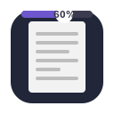

# 📚 Reading Progress Bar

<div align="center">
  
  <br>
  <h3>Never lose your place in long articles again!</h3>
  <p>A beautiful, customizable reading progress bar for your browser.</p>
  
  [](https://opensource.org/licenses/MIT)
  [](https://developer.mozilla.org/en-US/docs/Mozilla/Add-ons/WebExtensions/manifest.json/manifest_version)
</div>

## ✨ Features

- 🌈 **Beautiful Themes** - Choose from Solid, Gradient, Pulse, Glow, and Striped themes
- 🎨 **Eye-Soothing Colors** - 8 carefully selected color palettes for comfortable reading
- 📱 **Position Control** - Place the bar at the top or bottom of your screen
- 📊 **Progress Percentage** - Optional percentage indicator to track your progress
- 📲 **Smooth Scrolling** - Toggle smooth scrolling for a better reading experience
- 🧩 **Works Everywhere** - Compatible with all websites, blogs, and online articles

## 🚀 Installation

### From Browser Store
- **Firefox**: [Get it from AMO](https://addons.mozilla.org/en-US/firefox/addon/reading-progress-bar-pro/)

### Manual Installation
1. Clone this repository
   ```bash
   git clone https://github.com/r3dhulk/reading-progress-bar.git
   ```
2. Load as a temporary extension
   - Firefox: Visit `about:debugging` → This Firefox → Load Temporary Add-on → Select `manifest.json`
   - Chrome: Visit `chrome://extensions` → Enable Developer Mode → Load Unpacked → Select extension folder

## 🎛️ Customization Options

- **Theme**: Choose from 5 visually appealing themes
- **Color Palette**: Select from 8 carefully crafted eye-soothing color combinations
- **Bar Height**: Adjust the height from 2px to 20px
- **Position**: Place at top or bottom of the page
- **Progress Percentage**: Toggle display of current reading progress
- **Smooth Scrolling**: Enable for a smoother reading experience

## 💡 Usage Tips

- **Long Articles**: Perfect for keeping track of progress in lengthy blog posts and tutorials
- **Documentation**: Never lose your place in technical documentation
- **Research Papers**: Track your progress through academic papers
- **Portfolios**: Create a professional reading experience for your site visitors

## 🔧 Technical Details

Reading Progress Bar is built using standard web technologies:
- JavaScript (ES6+)
- CSS3 with animations and transitions
- WebExtensions API for cross-browser compatibility

## 🤝 Contributing

Contributions are welcome! Feel free to:

1. Fork the repository
2. Create your feature branch (`git checkout -b feature/amazing-feature`)
3. Commit your changes (`git commit -m 'Add some amazing feature'`)
4. Push to the branch (`git push origin feature/amazing-feature`)
5. Open a Pull Request

## 📄 License

This project is licensed under the MIT License - see the [LICENSE](LICENSE) file for details.

## 🙏 Acknowledgements

- Inspired by reading progress indicators on Medium and other reading-focused websites
- Icon design by Sumalya
- Thanks to all beta testers and contributors!

---

<div align="center">
  <p>Made with ❤️ for readers everywhere</p>
</div>